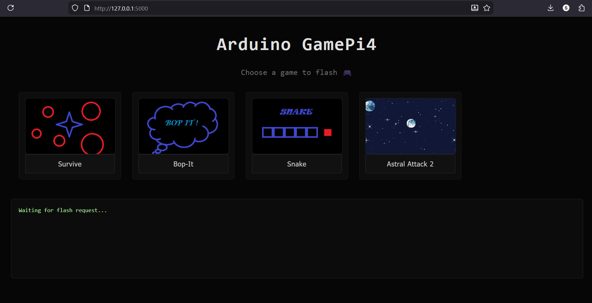
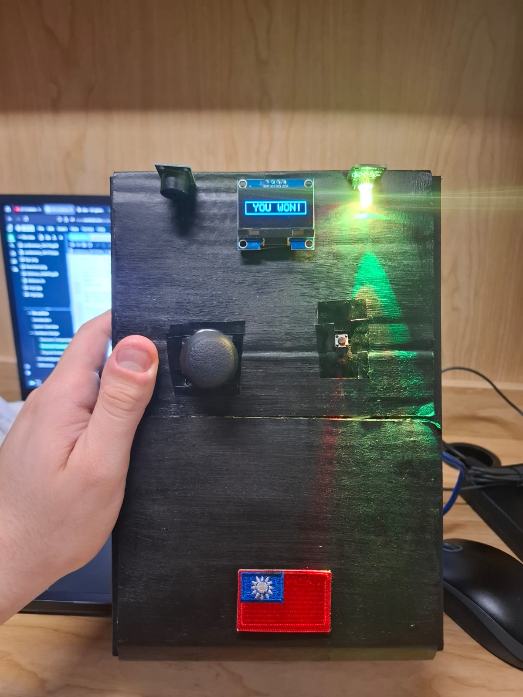
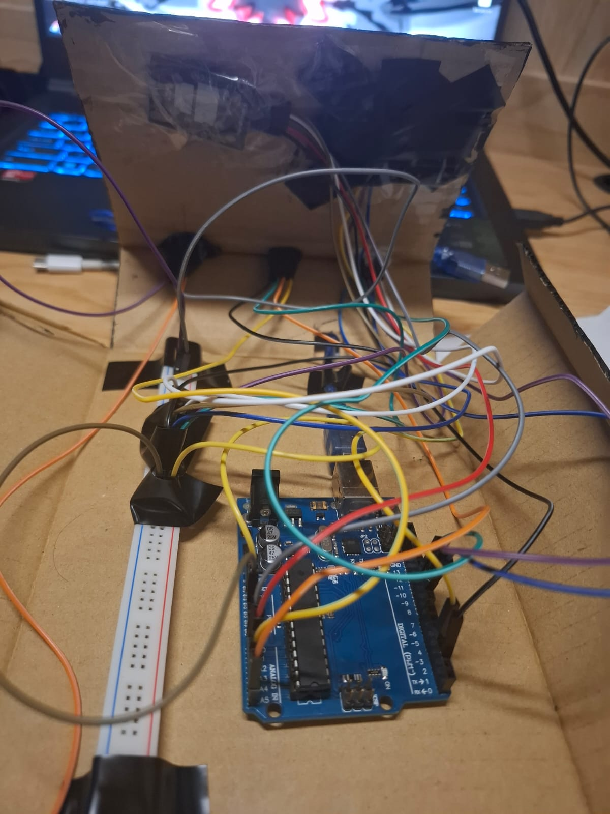
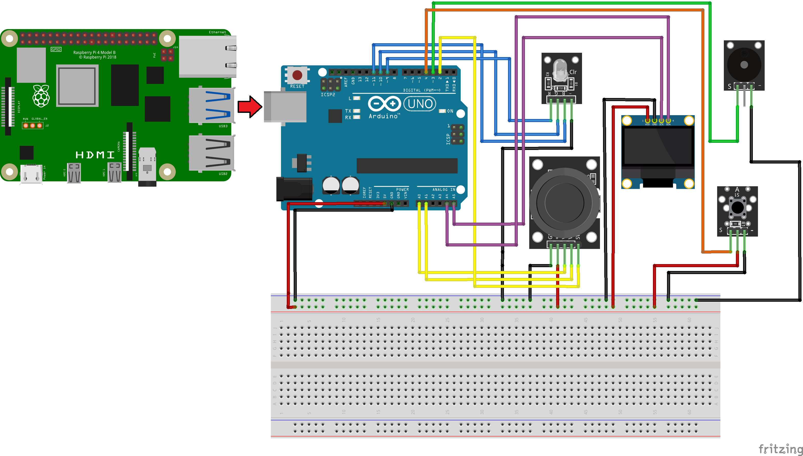

# Network-Based Remote Software Deployment System on Arduino Using Raspberry Pi

This project simulates a game console using an Arduino Uno and a Raspberry Pi. The Pi hosts a small Flask web app, stores precompiled `.hex` game binaries, and flashes the selected game onto the Arduino over USB with `avrdude`. The Arduino handles the actual gameplay through an OLED display, joystick, button, buzzer, and RGB LED.

<p align="center">
  
</p>

## Games

<table width="100%">
  <tr>
    <th>Astral Attack 2</th>
  </tr>
  <tr>
    <td align="center">
      
    </td>
  </tr>
  <tr>
    <td>Lane-based space shooter with bullets, enemies, scoring, RGB LED health feedback, buzzer feedback, and a final ending sequence.</td>
  </tr>
</table>

<table width="100%">
  <tr>
    <th>Snake</th>
  </tr>
  <tr>
    <td align="center">
      
    </td>
  </tr>
  <tr>
    <td>Classic Snake on a 128x64 OLED grid with food, growth, collision, score, buzzer feedback, and LED brightness scaling according to score.</td>
  </tr>
</table>

## Hardware

<p align="center">
  
  
</p>

- Arduino Uno
- Raspberry Pi 4
- 1.3-inch I2C SH1106 OLED
- joystick module
- push button
- passive buzzer
- RGB LED
- breadboard, jumper wires, and USB A-to-B cable

## How It Works

```text
Raspberry Pi hosts Flask server
  -> user chooses a game in the browser
  -> Flask receives the request
  -> Raspberry Pi flashes the matching .hex with avrdude
  -> Arduino Uno resets and starts the selected game
  -> game runs on the OLED console
```

The Arduino Uno cannot keep multiple games loaded at once, so the Raspberry Pi acts as the storage and deployment layer. Once the user selects a game in the browser, the flashing process begins, and once it finishes, the Arduino restarts and runs the selected game.

## Repository

```text
Arduino/
  AstralAttack2_130/      Arduino sketch and exported build files for Astral Attack 2
  Snake/                  Arduino sketch and exported build files for Snake

Raspberry Pi/
  app.py                  Flask web loader that calls avrdude
  games/                  precompiled .hex files flashed to the Arduino
  static/thumbnails/      images used by the web loader game cards

Videos/
  gameplay videos, GIFs, and README images
```

## Run The Loader

Install Flask on the Raspberry Pi:

```bash
pip install flask
```

Place the repo contents where the loader can find them, or set `GAMECONSOLE_DIR`:

```bash
export GAMECONSOLE_DIR=/home/pi/gameconsole
python3 "Raspberry Pi/app.py"
```

Then open:

```text
http://<raspberry-pi-ip>:5000
```

The app expects the Arduino Uno on `/dev/ttyACM0` and flashes with:

```bash
avrdude -v -patmega328p -carduino -P/dev/ttyACM0 -b115200 -D -Uflash:w:<game>.hex:i
```

## Wiring

<p align="center">
  
</p>

| Module | Arduino Pin |
| --- | --- |
| Joystick X | A0 |
| Joystick Y | A1 |
| Joystick switch | D2 |
| Push button | D4 |
| OLED SDA | A4 |
| OLED SCL | A5 |
| Buzzer | D3 |
| RGB LED red | D9 |
| RGB LED green | D10 |
| RGB LED blue | D11 |
